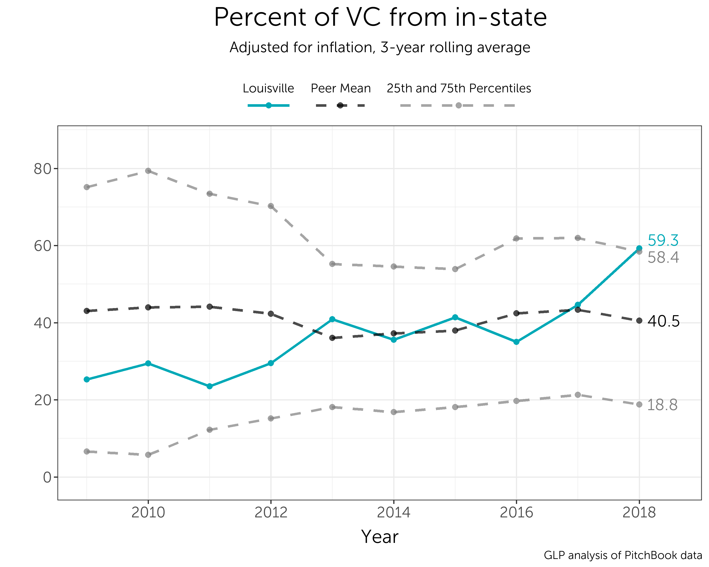
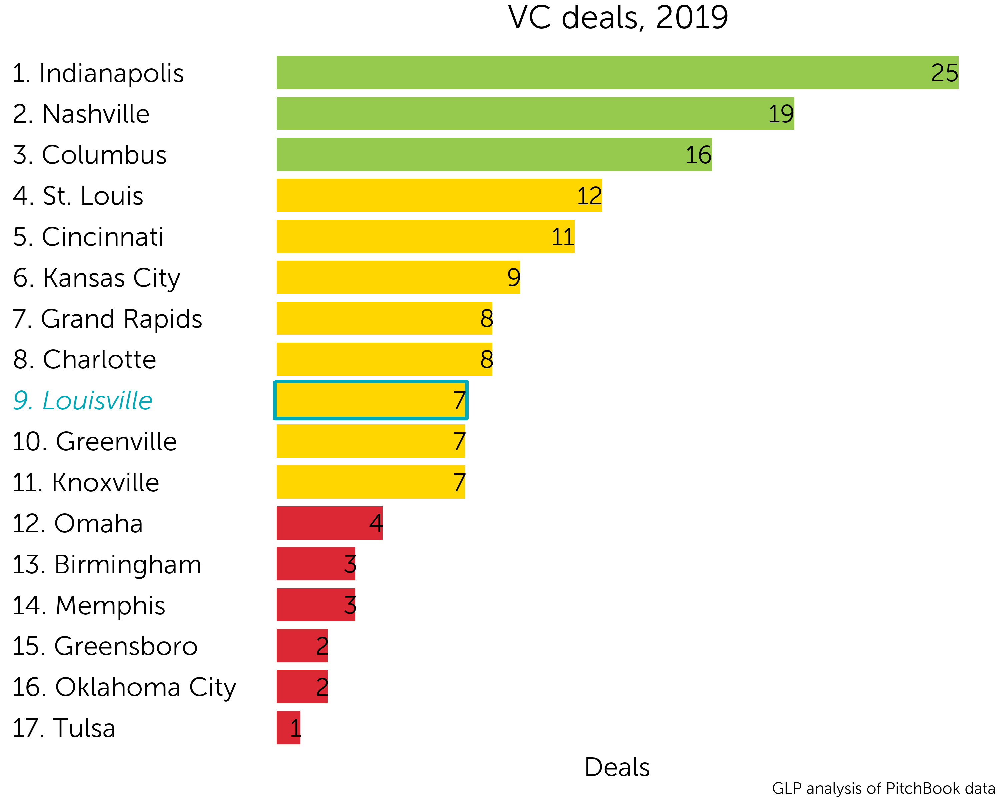
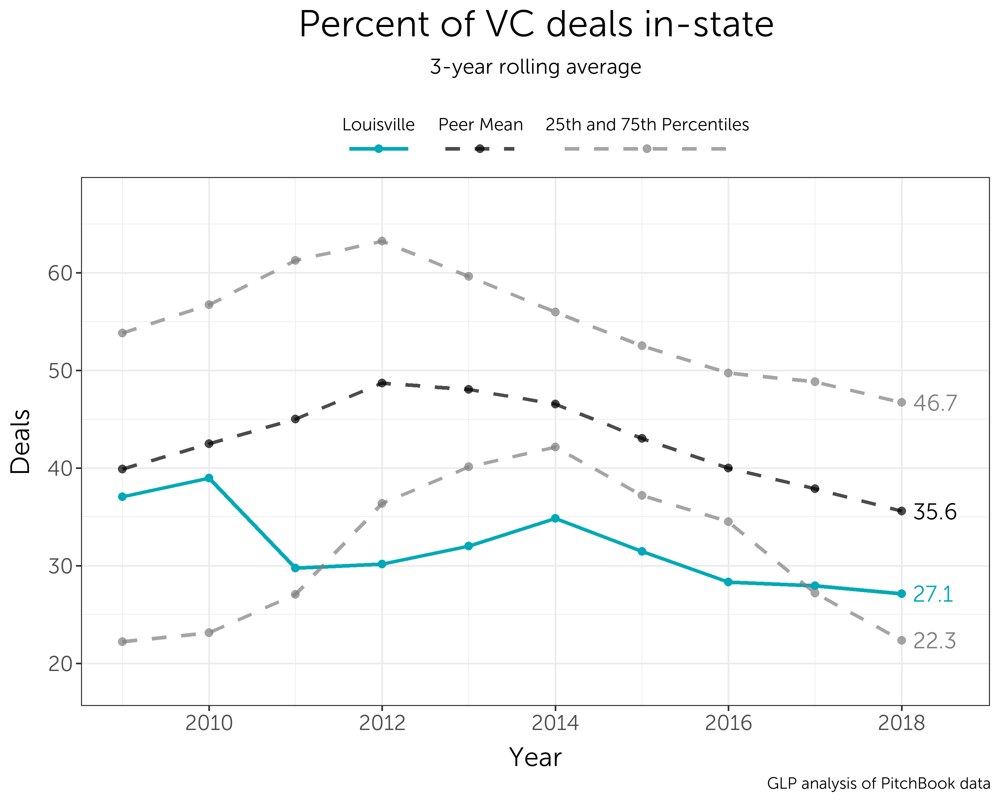

```{r setup, include=FALSE}
knitr::opts_chunk$set(echo = TRUE)
```

# Venture Capital in State

Louisville ranks 5th in the percent of venture capital coming from within the state


Over the past decade we've gone from below our peer mean to above it.



# Venture Capital Deals




