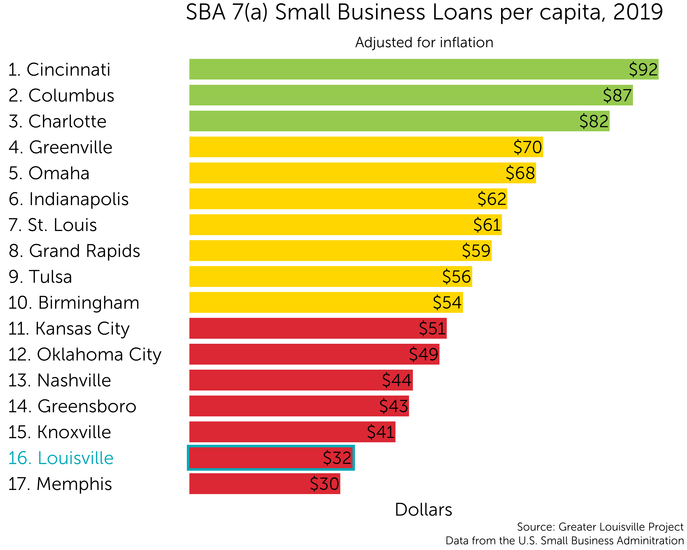
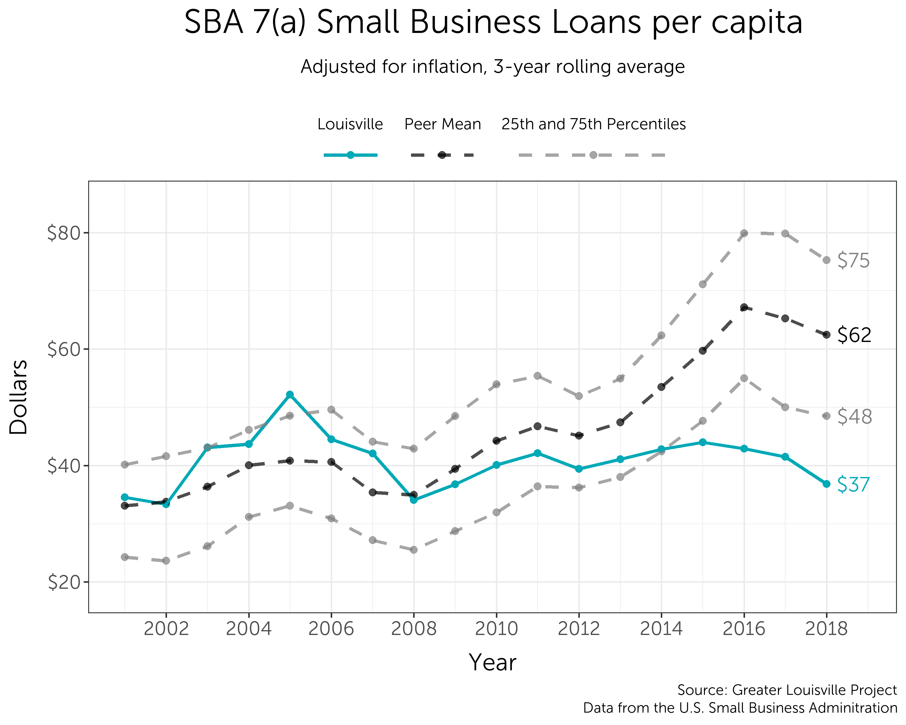
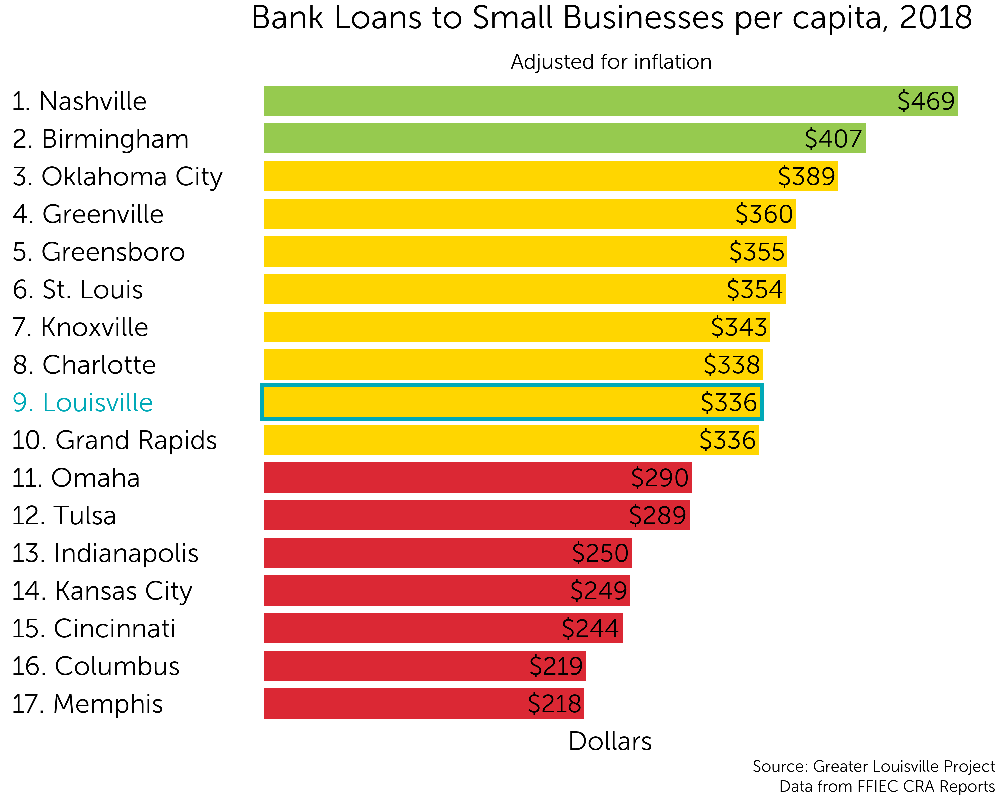
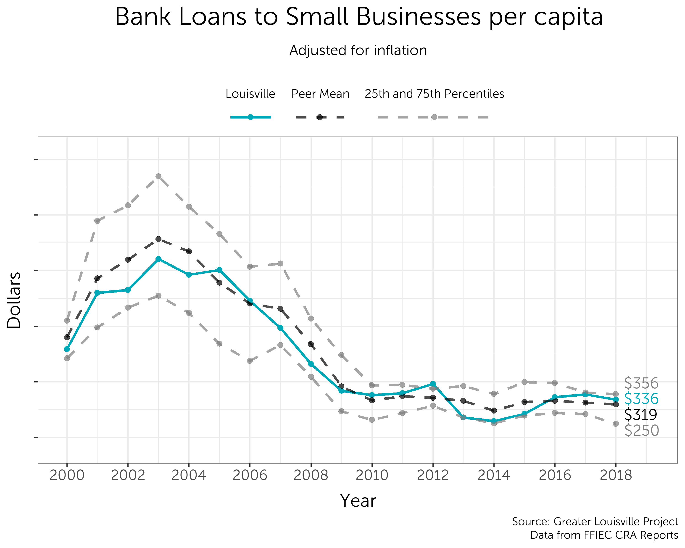
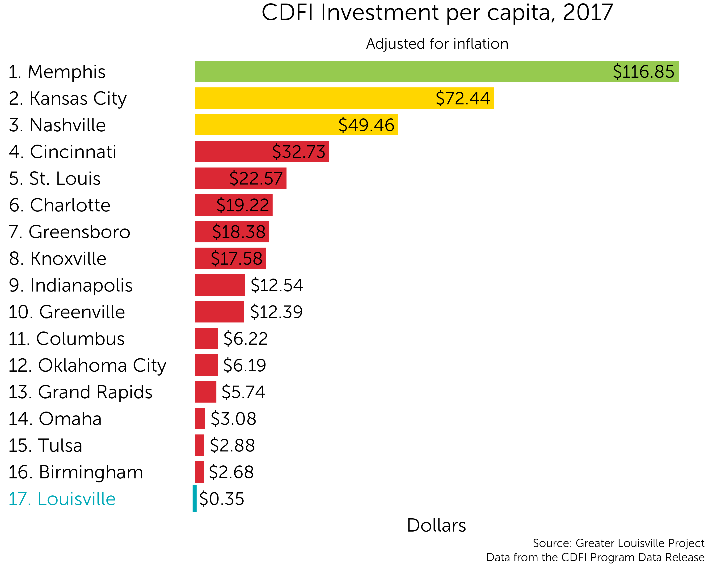

```{r setup, include=FALSE}
knitr::opts_chunk$set(echo = TRUE)
```

# Small Business Loans

Louisville has gone from the middle to the bottom 





# Community Reinvestment Act

Louisville is in the middle of our peer cities in Community Reinvestment and has been for 20 years. Overall CRA money has gone down everywhere this decade compared to last decade.






# Community Development Finanical Institutions

Louisville currently ranks last in investment by Community Development Financial Institutions per capita and has steadily ranked towards the bottom of our peer cities.




# Venture Capital Deals

Louisville is in the middle for total number of venture capital deals.


# Venture Capital In State

Louisville has increasingly had more of it's overall VC funding come from in-state, although the percent of in-state deals has held steady. 


