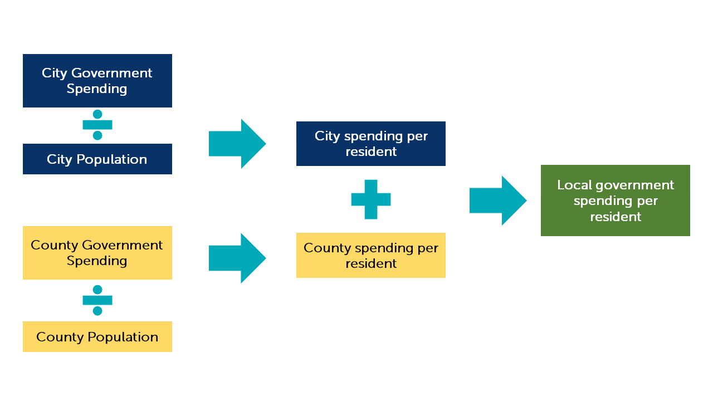

<style type="text/css"> 
h1 { 
  text-align: center; 
} 
h1,h2,h3,h4,h5,h6 { 
  font-family: "Museo Sans 300"; 
} 
body{ 
  font-family: "Museo Sans 300"; 
  font-size: 15px; 
} 
</style> 

```{r setup, include=FALSE}
knitr::opts_chunk$set(echo = TRUE)
```

Public investment represents the amount of money spent by the city and county gover

# Local Government Spending

Local government spending is the amount of general fund spending per person from both the city and county budgets. Louisville's local government spending is in the bottom tier of our peer cities.

While Louisville ranks 10th on this metric, it should be noted that Louisville's spending is essentially the same as the three governments after it. Louisville's spending would have to drop by less than 1% for Louisville to drop from 10th and 13th in local government spending. 


Louisville is a combined city-county government, while most of our peer cities are separate city and county governments. To create comparable data, we first calculated spending per resident for both city and county governments. We then added the two amounts together.



Liz Farmer, Governing Magazine's public finance reporter, performed the analysis presented in this report. The GLP performed seperate versions of the analysis, one using different city and county budget documents and another using tax revenue estimates. The other analyses' findings are consistent with the one presented in the report: Louisville's local government spending is in the bottom tier of its peer cities.