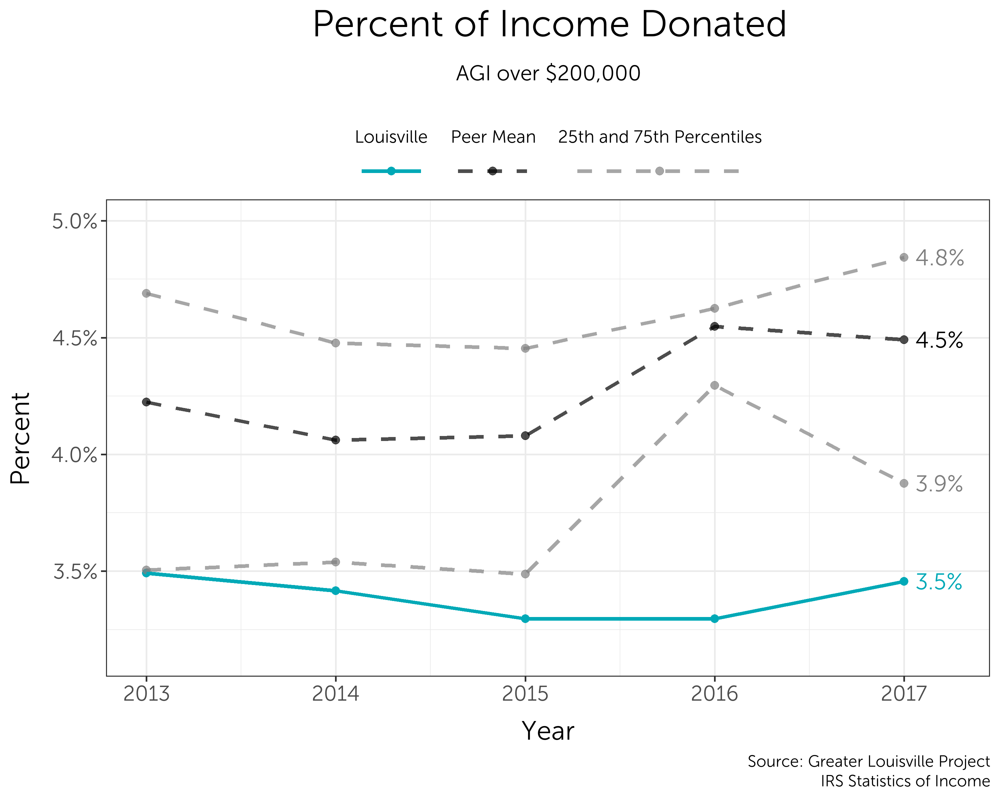

<style type="text/css"> 
h1 { 
  text-align: center; 
} 
h1,h2,h3,h4,h5,h6 { 
  font-family: "Museo Sans 300"; 
} 
body{ 
  font-family: "Museo Sans 300"; 
  font-size: 15px; 
} 
</style> 


```{r setup, include=FALSE}
knitr::opts_chunk$set(echo = TRUE)
library(dplyr)
library(readr)
```

Social investment consists of the resources avaiable to our nonprofit sector. The obtain a broad understanding of Louisville's standing in this area, we examine two sources of flows into the nonprofit sector: individual donations and foundation grants, as well as monetary receipts to nonprofit organizations.

# Individual Giving 

Louisville ranks toward the bottom of its peers in terms of the percent of income donated by those with Adjusted Gross Income over $200,000, the highest income group available in the data.


Over time, the average percent of income donated among out peer cities has increased, while the average peercent of income donated in Louisvile has remained consistent.



Among almost all peer cities, donor participation is very high. In fact, Louisville has one of the highest rates of reported charitable donations among those with an income of over $200,000.


Individual giving data comes from the IRS's Statistics of Income. It is based on charitable deductions recorded in tax documents. We focus on the top income bracket because almost all filers itermize their deductions, so the data set is nearly complete. While there is some data on lower income brackets, most filers below the top income bracket do not itemize their taxes, so the data on their charitable donations is much less consistent. The table below shows the income groups available in IRS data and the percent of filers in each incom group who itemize their deductions.

```{r, echo=FALSE, message=FALSE}
individual_giving <- read_csv("output_data/charitable_giving.csv")

itemizing_percent <- individual_giving %>% 
  filter(FIPS == "21111", year == 2017) %>%
  select(agi, pct_itemized) %>%
  transmute(
    `Adjusted Gross Income` = 
      recode(agi, "Under $1", "$1 to $25,000", "$25,000 to $49,999", "$50,000 to $74,999",
                  "$75,000 to $99,999", "$100,000 to $199,999", "$200,000 or more"),
    `Percent of Returns Itemized` = pct_itemized %>% scales::percent(scale = 1))
  
  
knitr::kable(itemizing_percent, "markdown")
```

# Foundation Grants

Foundation grants are one of the major sources of funding for nonprofit organizations. In 2017, Louisville ranked toward the bottom of its peers in  the amount of grants issued by philanthropies.


Louisville ranks slightly higher in terms of overall philanthropic assets.


# Nonprofit Donations

As a result of relatively low individual contributions and foundation grantmaking in our city, Louisville ranks second to last among its peers in the donations received by nonprofit organizations.


Fondation and nonprofit financial data comes from IRS 990 documents. For the purposes of this analysis, we chose to separate hospitals, schools, and community foundations from the majority of our analysis. While these organizations are incredibly valuable, they are also very large. The amount of money flowing through nonprofit hospital systems, university endowments, etc. is very large compared to the rest of the nonprofit ecosystem, and excluding them from our data allows us to focus on the amount of resources available to the rest of the nonprofit community, which would otherwise be overshadowes.

