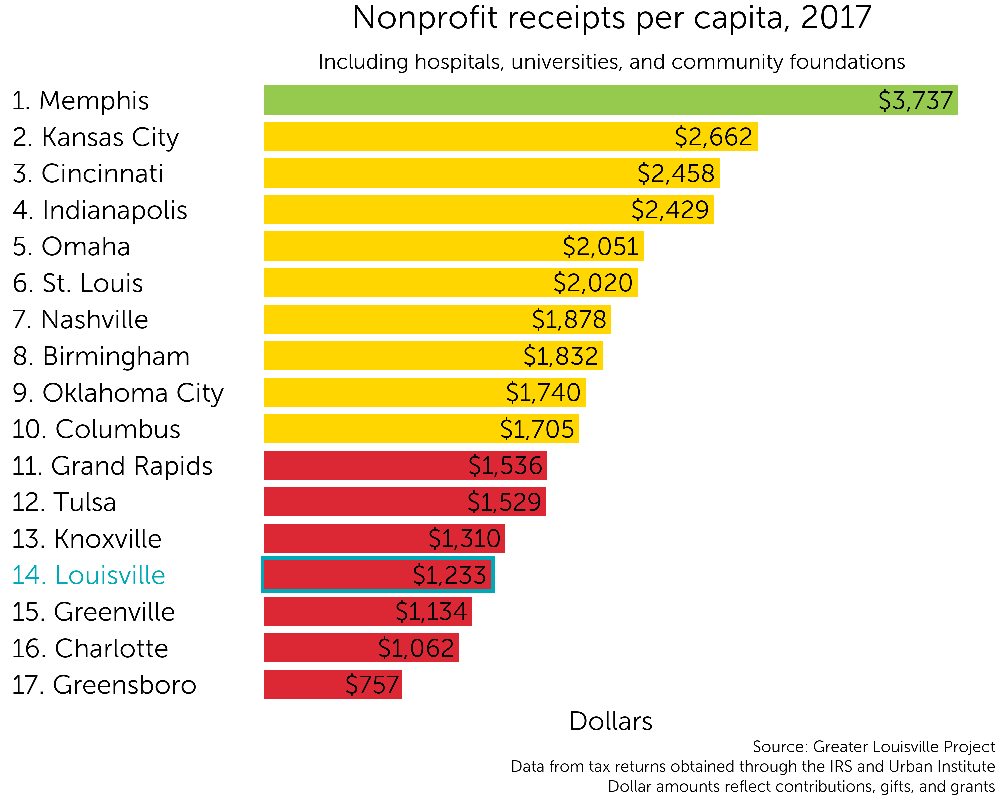
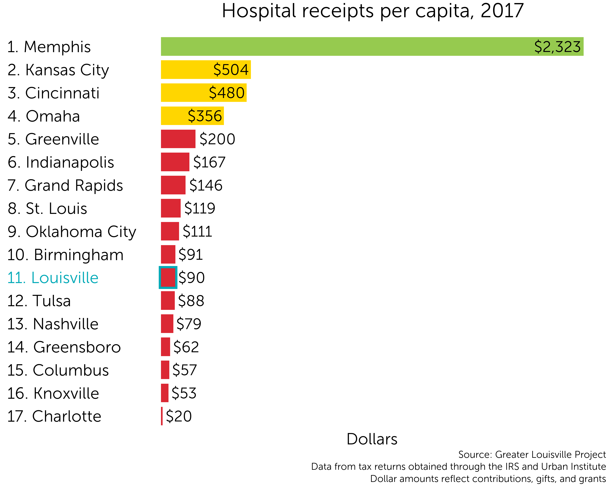
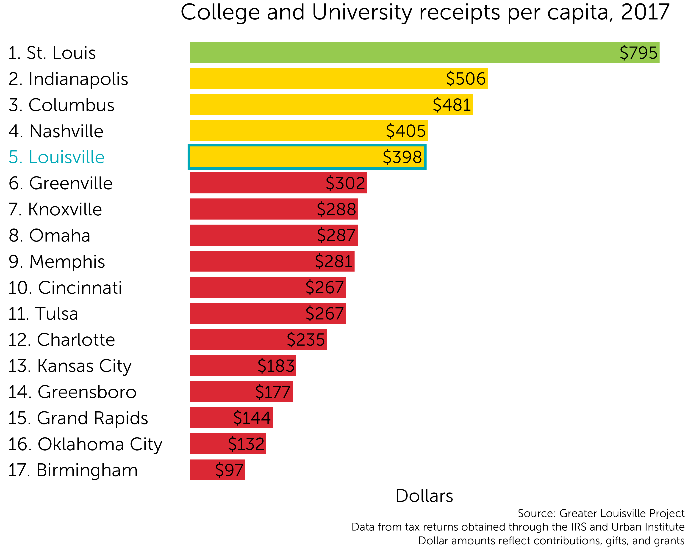
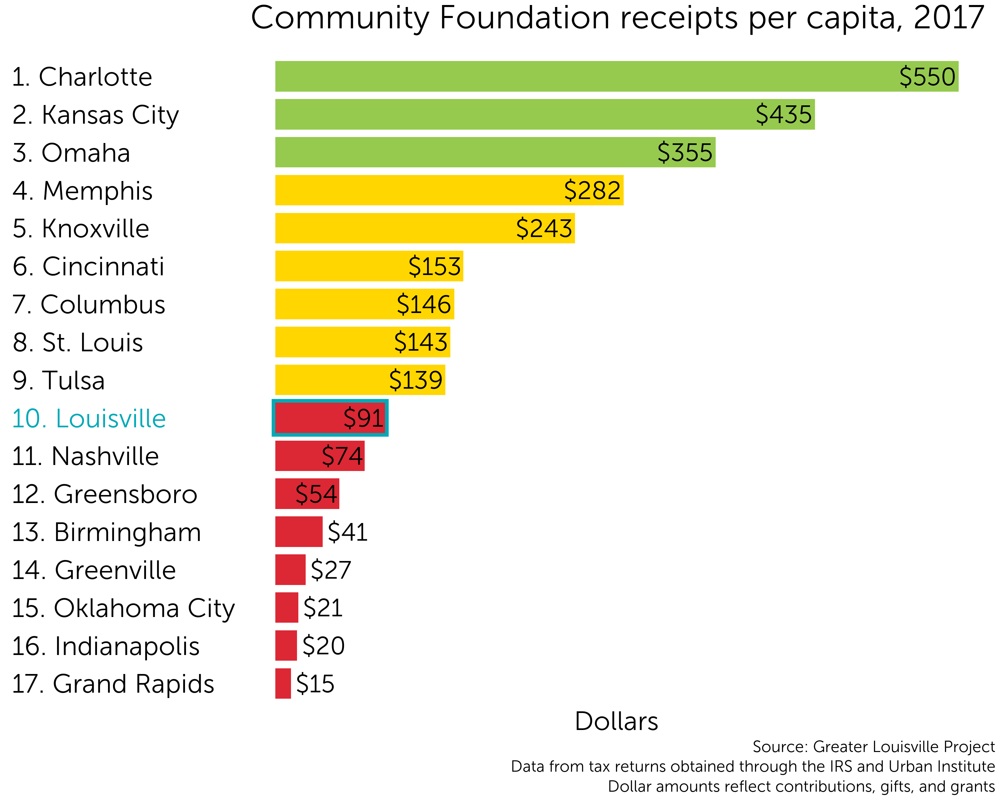
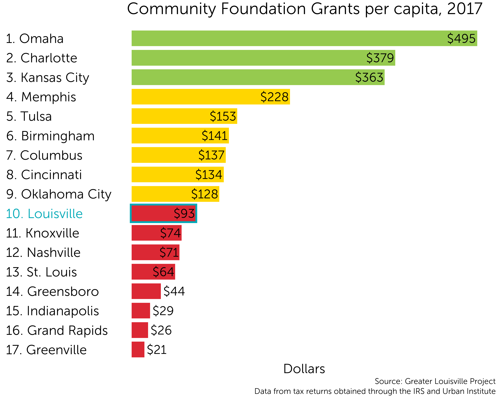

```{r setup, include=FALSE}
knitr::opts_chunk$set(echo = TRUE)
library(dplyr)
library(readr)
```

<center>
For this report, we define social investment as the financial resources available to Louisville's nonprofit sector. To obtain a broad understanding of our community's standing in this area, we examine two sources of flows into the nonprofit sector: <b>individual giving</b> and <b>foundation grants</b>. To measure the results of our collective giving and ability to attract resources from other areas, we measure <b>nonprofit donations</b>.
</center>

<br>

***

<br>

# Individual Giving 

Individual giving measures the amount of donations individuals make to organizations such as charities and religious institutions. Our data comes from IRS tax filings. We focus on data for filers with an income over $200,000 because they have a very high rate of itemizing deductions, so the data is very complete. <b>We find that while Louisville ranks 2nd  in the percentage of residents donating to charity, Louisville ranks 16th in the percentage of income donated.</b> 

## Ranking

Louisville ranks toward the bottom of its peers in terms of the percent of income donated by filers with an Adjusted Gross Income of over $200,000, the highest income group available in the data.

{width=80%}

## Trend

Over time, the average percent of income donated among Louisville's peer cities has increased, while the average percent of income donated in Louisvile has remained fairly constant. <b>In 2017, Louisville filers with an AGI of over \$200,000 donated an average of 3.5% of their income compared to a peer average of 4.5%.</b> If residents in this income group donated an addition 1% of their income so Louisville were at the peer average, an additional \$80 million dollars would be made available to our nonprofit community.

{width=80%}


## Participation

Among almost all peer cities, donor participation is very high. In fact, Louisville has one of the highest rates of reported charitable donations among those with an income of over $200,000.

{width=80%}

## Methodology {.tabset .tabset-fade}

### Sources and Notes

Our calculations are based on charitable deductions recorded in tax documents. We calculate the average percent of income donated by dividing the total amount of charitable giving deductions by the total amount of income.

There are some caveats to the data. Tax deductions for charitable donations are limited to 60% of a person's AGI, so some donations made above this limit are not captured in the data. It is also likely that tax filers sometimes over- or under-report their donations due to human error or issues with recordkeeping. While issues of accuracy are possible, filers do have a large incentive to report accurate data to both maximize their deductions and avoid penalties from the IRS.

Individual giving data comes from the IRS's Statistics of Income County data available here: https://www.irs.gov/statistics/soi-tax-stats-county-data

<br>

***

<br>

### Income brackets

We focus on the top income bracket because almost all filers itermize their deductions, so the data set is very complete. While we would like to perform an analysis of all income brackets, the data for income brackets below \$200,000 is much less complete. For example, about 79% of Louisville filers in the \$25,000 to \$49,999 bracket opted to take the standard deduction instead of itemizing their deductions. Some of these filers likely donated to charity, but not at a rate that made itemizing preferable to the standard deduction.

```{r, echo=FALSE, message=FALSE}
individual_giving <- read_csv("output_data/charitable_giving.csv")

itemizing_percent <- individual_giving %>% 
  filter(year == 2017) %>%
  group_by(agi) %>%
  summarise(
    pct_itemized_lou = pct_itemized[FIPS == "21111"],
    pct_itemized_peers = mean(pct_itemized[FIPS != "21111"])) %>%
  transmute(
    `Adjusted Gross Income` = 
      recode(agi, "Under $1", "$1 to $25,000", "$25,000 to $49,999", "$50,000 to $74,999",
                  "$75,000 to $99,999", "$100,000 to $199,999", "$200,000 or more"),
    `Percent of Louisville Returns Itemized` = pct_itemized_lou %>% scales::percent(scale = 1),
    `Percent of Peer Returns Itemized` = pct_itemized_peers %>% scales::percent(scale = 1))
  
knitr::kable(itemizing_percent, "markdown", align = "ccc")
```

<br>

***

<br>

### Income vs. AGI {.tabset .tabset-fade}

There is a slight difference in the data when calculating donations as a percent of AGI vs income. We show donations as a percent of income in the above graphs for simplicity, but you can see the minor differences between the two below. Both methods result in roughly the same data for Louisville: filers with an AGI of over $200,000 donated 3.5% of their income in 2017, placing Louisville 16th among its peers.

#### Income 

{width=80%}

<br>

***

<br>

#### AGI

{width=80%}

<br>

***

<br>

# Foundation Grants
Foundation and nonprofit financial data comes from IRS 990 documents. For the purposes of this analysis, we chose to separate hospitals, schools, and community foundations from the our analysis. While these organizations are incredibly valuable, they are also very large. The amount of money flowing through nonprofit hospital systems, university endowments, etc. is very large compared to the rest of the nonprofit ecosystem, and excluding them from our data allows us to focus on the amount of resources available to the rest of the nonprofit community, which would otherwise be overshadowed. An analysis of this decision is available in the methodology section at the very bottom of this page.

Foundation grants are one of the major sources of funding for nonprofit organizations. Endowed resources have become an increasingly important source or revenue for nonprofits: as a percentage of national charitable giving, foundation grants have increased from 12% of national giving in 2000 to 18% in 2018.

## Grants Ranking

In 2017, Louisville ranked toward the bottom of its peers in the amount of grants issued by philanthropies.

{width=80%}

## Assets Ranking

Louisville ranks slightly higher in terms of overall philanthropic assets.

{width=80%}

## Methodology

See the methodology section for "Nonprofit Donations"

<br>

***

<br>

# Nonprofit Donations

## Ranking 
As a result of relatively low individual contributions and foundation grantmaking in our city, Louisville ranks second to last among its peers in the donations received by nonprofit organizations.

{width=80%}

## Methodology {.tabset .tabset-fade}

### Sources

Our data combines tax information from the Urban Institute's National Center for Charitable Statistics, the IRS's digitized records, and PDFs of tax returns obtained from archive.org.

### Data analysis

While working with the data, newer data became available from improved sources. As such, we ran the analysis using multiple data sources and for multiple years before arriving at out final, most up-to-date analysis. Our first approach relied on Urban Institute data from 2014. Our second approach relied on a combination of Urban Institute data and digitized information from 990 PDFs, and our final analysis combines data from all three to cross-check and complete the data set to the fullest extent possible. While this process improved the quality of the data, the results were the same across the different specifications. 

### Alternate models {.tabset .tabset-fade}

For the purposes of our analysis, we excluded hospitals, colleges and universities, and community foundations from the data set. While hospitals, colleges, and universities are important community organizations, their finances are very large and often of a different nature than the rest of the nonprofit ecosystem. There are also many nonprofits which are "pass-through" fundraising organizations for hospitals and universities, and excluding them from our analysis prevents the double counting of the donations. We excluded community foundations because they create issues with double counting of donations. Additionally, they play a role in between a nonprofit and a foundation and are organized differently across communities. We show the impact of these decisions below, and we come to the conclusion that our analysis is robust: these decisions do not impact our conclusion that we rank toward the bottom of our peer cities in social funding.

#### All nonprofits

Including hospitals, colleges, universities, and community foundations in our analysis moves Louisville form 16th to 14th, however we still rank near the bottom of our peers.

{width=80%}

#### Hospitals

Louisville seems to rank toward the middle of its peers in donations to hospitals per capita. However, many hospital systems extend beyond the boundaries of the communities they are headquartered in, so the data is not very comparable across cities.

{width=80%}

#### Colleges and Universities

Louisville seems to rank toward the top of its peersin terms of donations to colleges and universities. However, there is a large amount of double-counting due to pass-through organizations, so the data is not reliable.

{width=80%}

#### Community Foundations {.tabset .tabset-fade}

##### Receipts

Louisville ranks toward the middle of its peer cities in donations to community foundations. We exclude community foundations from our analysis of nonprofit receipts because the money they distribute is captured as donations to other nonprofits.

{width=80%}

##### Grants

Louisville ranks toward the middle of its peer cities in grants from community foundations. We exclude community foundations from our analysis of foundation grants because they function very differently than other foundations. Including them in our analysis of foundation grants moves Louisville from 15th to 14th, so our conclusions remain the same.

{width=80%}

